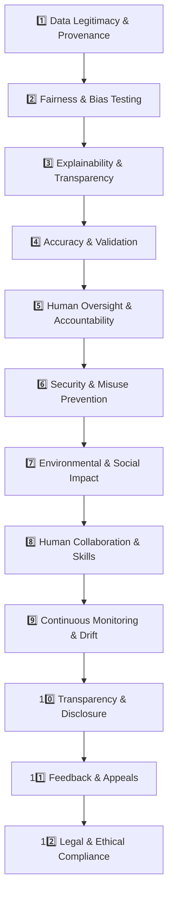

# The Ethical AI Lifecycle — *Building Responsible Intelligence* 🤖  

AI isn’t just about data and models — it’s about people, impact, and accountability.  
This guide walks through a **12-step lifecycle** for developing, deploying, and maintaining **ethical, transparent, and trustworthy AI systems**.  

---

## 🧭 Overview  

AI ethics can be complex, but the foundation is simple:  
> *Build AI that is fair, explainable, secure, sustainable, and aligned with human values.*

Below is a lifecycle-based approach that captures each of those pillars.

---

## 🌱 1. Data Legitimacy & Provenance  

Before training, always ask: **Where did this data come from, and do I have the right to use it?**  
High-quality, legally sourced data is essential. Follow privacy laws such as **GDPR**, **CPRA**, or **UK DPA**.  

**Example:** Clearview AI scraped billions of facial images without consent — a reminder that ignoring provenance can destroy public trust overnight.  

---

## ⚖️ 2. Fairness, Bias & Representation  

Check whether your model treats people equitably across groups (gender, ethnicity, age, etc.).  
Hidden bias in training data can cause real-world harm.  

**Example:** Amazon’s résumé screening AI downgraded female applicants due to biased historical data. Continuous bias testing prevents such issues.  

---

## 🧠 3. Explainability & Interpretability  

An AI decision should never be a mystery. Use **explainable AI (XAI)** tools to show *why* a model made a decision.  

**Example:** Banks now provide “reason codes” when credit is denied by an algorithm — increasing fairness and transparency.  

---

## 🧩 4. Accuracy, Reliability & Validation  

Validate models regularly to confirm accuracy and consistency.  
For **high-risk applications**, combine automation with **human review**.  

**Example:** Tesla continuously retrains and monitors its Autopilot models to avoid reliability drift.  

---

## 👩‍💻 5. Human Oversight & Accountability  

Define who is responsible when AI makes a mistake.  
Automation must **support**, not **replace**, human judgment.  

**Example:** Air traffic AI systems assist operators but never act alone — final control always lies with trained humans.  

---

## 🔒 6. Security & Misuse Prevention  

AI systems are prime targets for manipulation, data poisoning, and adversarial attacks.  
Encrypt sensitive data and conduct security audits regularly.  

**Example:** Researchers fooled image classifiers by slightly altering stop signs, showing why adversarial testing is vital.  

---

## 🌍 7. Environmental & Social Impact  

Ask whether the system’s computational cost matches its benefit.  
Monitor energy usage and offset carbon when possible.  

**Example:** DeepMind used its own AI to reduce Google’s data center energy consumption by 40%.  

---

## 🧑‍🤝‍🧑 8. Human Collaboration & Skills  

AI should **augment** human creativity and decision-making — not make people redundant.  
Support employee upskilling and redefine roles thoughtfully.  

**Example:** Journalists using AI for routine summaries gained more time for investigative and creative work.  

---

## ⚙️ 9. Continuous Monitoring & Model Drift  

AI systems evolve with data. Regularly check for **drift**, **bias re-emergence**, and **context changes**.  

**Example:** Netflix constantly retrains its recommendation model to reflect new viewing trends.  

---

## 📢 10. Transparency & Disclosure  

Always tell users when they’re interacting with AI and what its limits are.  
This clarity builds trust and prevents confusion.  

**Example:** Many banking chatbots now start with, “You’re speaking with an AI assistant.”  

---

## 📬 11. Feedback, Appeals & Redress  

If an automated decision affects someone, they must have a way to contest it.  
Provide a transparent appeals process and human review when needed.  

**Example:** Credit bureaus let users challenge algorithmic errors — accountability in action.  

---

## ⚖️ 12. Legal & Ethical Compliance  

Stay aligned with both **existing laws** and **emerging AI regulations** like the EU AI Act.  
Good ethics should guide your design before the law demands it.  

---

## 🧩 Visual Summary  

Below is a **Mermaid diagram** capturing the AI Ethics Lifecycle:  

---

## 🧭 The Ethical AI Compass  

| Pillar | Focus | Key Questions |
|:--|:--|:--|
| **Fairness** | Avoid bias and discrimination | Who benefits or is excluded? |
| **Transparency** | Explainable and honest decisions | Can users understand outcomes? |
| **Accountability** | Human oversight and recourse | Who’s responsible for mistakes? |
| **Sustainability** | Environmental and social balance | Is the system good for society long-term? |

> “Ethical AI isn’t a compliance checkbox — it’s a continuous feedback loop that keeps technology aligned with human values.” 💡

---

